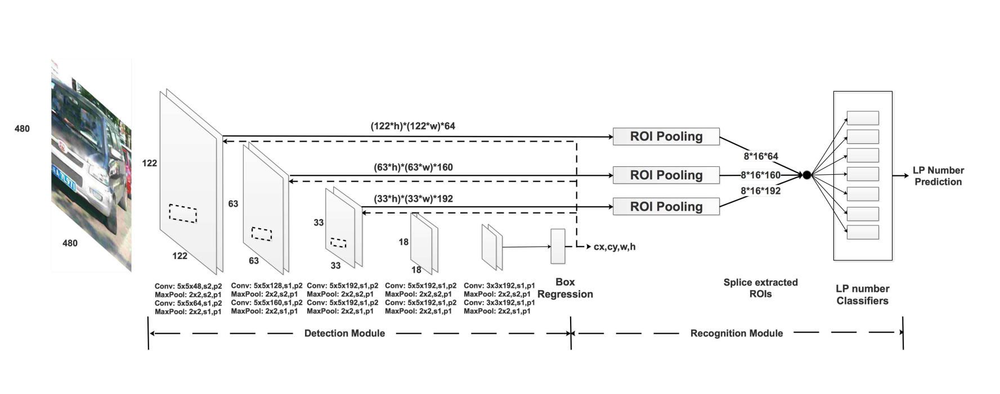

# Project Title:
End-to-End License Plate Detection and Recognition

## Objective:
The aim of this project is to detect a License Plate(LP) in image of vehicle and then recoginize the corresponding LP number simultaneously with high speed and accuracy.

## Approach:
We use 10 Convolutional Neural Network(CNN) layers to extract features from the input image and then use fully connected layers for prediction of the bounding box around the License Plate. After detection of LP we use the "Recognition Module" which exploits Region of Interest(ROI) to extract features map of interest and several classifiers to predict the corresponding license plate number. The entire module is a single unified network for License Plate detection and recognition.

### Detection Accuracy Metric:
For Detection Accuracy metric the bounding box is considered to be correct if and only if its Intersection-over-Union(IoU) with the ground-truth bounding box is more than 70%(IoU>0.7)

### Recognition Accuracy Metric:
For Recognition Accuracy metric, a License Plate(LP) recognition is considered to be correct if and only if the IoU is greater than 0.6 and all of the characters in the LP numbers are correctly recognised.

## Dataset:
In this project we use CCPD, a large and comprehensive LP datasets. To our best knowledge CCPD is largest publicly available  LP datasets with over more than 250k unique car images, and the only one provides vertices location annotations.   

|                     |  Zemris       |  Azam         | AOLPE         | CCPD          |
| -------------       |:-------------:|:-------------:|:-------------:|:-------------:|
|     Year            | 2002          | 2015          | 2017          | 2018          |
| Number of images    | 510           | 850           | 4200          | 250k          |
| Var in distance     |               |               |               |               |
| Var in tilt degrees |               |               |               |               |
| Var in blur  	      |               |               |               |               |
| Var in illumination	|		            |               |               |               |
| Var in weather      |               |               |               |               |
| Annotations         |               |               |               |               |

## Pipeline
The input is an image of car which passes through our trained model. This will first detect the License Plate in image of car and than predict the number present on it. The network architecture of our model as follows.

  

